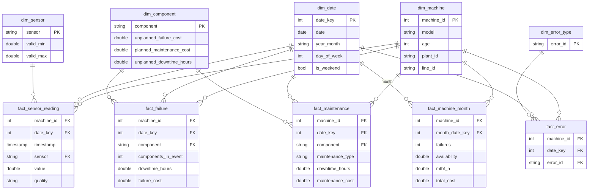

# Industrial IoT Sensor Analytics Platform

An end-to-end **Data Engineering + Machine Learning** platform that turns raw industrial sensor data into early failure warnings and business decisions, moving a plant from **reactive** to **predictive maintenance**.

> **Status:** 🚧 In development. Phases 1–5 complete: project setup, data acquisition, Bronze, Silver and Gold layers. See the **Roadmap** section below for progress.

---

## 📌 Problem Statement

Manufacturing plants run fleets of machines (pumps, motors, compressors) equipped with sensors that measure temperature, vibration, pressure, rotation and voltage. Most plants still face these problems:

| Problem | Impact |
|---|---|
| **Unplanned breakdowns.** Maintenance is reactive (fix after failure) or calendar-based. | Production stops, emergency repairs, parts replaced too early or too late |
| **Messy raw sensor data:** missing values, glitches, duplicates, inconsistent formats | Data isn't trusted, so it isn't used |
| **Static alarm thresholds** (e.g. alert when temperature > 90°C) | Alerts fire too late, false alarms, gradual degradation is missed |
| **No single view** across operations, maintenance and management | Decisions are based on intuition, not data |

## 🎯 What This Project Solves

1. **Reliable data:** an automated pipeline that ingests, cleans, validates and models sensor data.
2. **Early detection:** ML models that detect abnormal behaviour and **predict failures 24 hours in advance**.
3. **Visibility:** dashboards for operators, maintenance teams and management.
4. **Business value:** quantifies downtime avoided, cost savings and reliability KPIs (MTBF, MTTR, availability), and recommends which machine to service first.

---

## 🏗️ Architecture

The project follows a **Medallion Architecture** (Bronze → Silver → Gold), followed by data modelling, ML, dashboards and business insights.

```
┌──────────────┐   ┌──────────────┐   ┌──────────────┐   ┌──────────────┐
│ SENSOR DATA  │──►│ BRONZE LAYER │──►│ SILVER LAYER │──►│  GOLD LAYER  │
│ telemetry,   │   │ raw, as-is,  │   │ cleaned,     │   │ aggregated,  │
│ errors, logs,│   │ + metadata   │   │ validated    │   │ features,KPIs│
│ machine info │   │ (Parquet)    │   │ (Parquet)    │   │ (Parquet)    │
└──────────────┘   └──────────────┘   └──────────────┘   └──────┬───────┘
                                                                │
                                         ┌──────────────────────┴───┐
                                         ▼                          ▼
                                  ┌──────────────┐          ┌──────────────┐
                                  │ DATA MODEL   │◄─────────│   MACHINE    │
                                  │ star schema  │ predic-  │   LEARNING   │
                                  │ facts + dims │ tions    │ anomaly, 24h │
                                  └──────┬───────┘          │ failure, RUL │
                                         │                  └──────────────┘
                                         ▼
                                  ┌──────────────┐          ┌──────────────┐
                                  │  DASHBOARD   │─────────►│  BUSINESS    │
                                  │ ops, maint., │          │  INSIGHTS    │
                                  │ executive    │          │ cost, KPIs,  │
                                  └──────────────┘          │ actions      │
                                                            └──────────────┘
        Cross-cutting: data quality checks · logging · tests · orchestration
```

### 1️⃣ Sensor Data (Source)

**Primary source:** [Microsoft Azure Predictive Maintenance dataset](https://www.kaggle.com/datasets/arnabbiswas1/microsoft-azure-predictive-maintenance) (Kaggle). It covers 100 machines with hourly readings for a full year.

| File | Content |
|---|---|
| `PdM_telemetry.csv` | Hourly sensor readings: voltage, rotation, pressure, vibration |
| `PdM_errors.csv` | Machine error events |
| `PdM_maint.csv` | Component replacement / maintenance records |
| `PdM_failures.csv` | Component failure records |
| `PdM_machines.csv` | Machine metadata: model, age |

**Enhancements (hybrid approach):**
- **Data contract:** 45 automated checks (files, columns, row counts, date ranges, machine IDs, allowed values) confirm the source data is complete before any processing.
- **Data-quality injection:** the original dataset is very clean, so a reproducible script adds realistic problems to a *copy* of the telemetry: **stuck sensors**, **missing values**, **impossible spikes** and **duplicate rows**. A manifest records exactly what was injected, so the Silver layer can later be proven to catch every problem. Original files are never modified.
- **Business reference data:** each machine is assigned to a plant (Pune, Chennai) and production line, and a cost table compares an unplanned failure with planned maintenance per component (repair cost, emergency premium, downtime). Costs are illustrative assumptions set in `config/settings.yaml`.

### 2️⃣ Bronze Layer: Raw Landing
- Exact, unchanged copy of the 7 sources stored as **Parquet**. Every source column is kept **as text**, exactly as received (schema-on-read), so nothing is lost or silently converted.
- Adds lineage metadata to every row: `_source_file`, `_source_line`, `_ingested_at`, `_batch_id`.
- **Idempotent:** each file's SHA-256 hash is logged, so re-runs skip unchanged files. Row counts are reconciled on every load.
- **Verified with SQL:** a DuckDB report checks every table (exists, readable, row counts, columns, single batch).
- No cleaning, so the data can always be reprocessed from here.

### 3️⃣ Silver Layer: Cleaned & Validated
- Type casting, timestamp standardisation, consistent naming; unparseable values counted.
- Deduplication, physical-limit validation (spikes → null) and **stuck-sensor detection**.
- Complete hourly grid per machine; short gaps (≤ 3 h) filled with the 24 h window mean, longer gaps left empty.
- A **quality flag** per sensor value: `ok`, `filled` or `missing`.
- Machines joined with their plant and production line; events validated against known machines and components.
- **Proven, not assumed:** the quality report checks the cleaning against the injection manifest and the clean original data.

### 4️⃣ Gold Layer: Business & ML Ready
- **ML features** (one row per machine every 3 h): 3 h / 24 h rolling sensor statistics, trends, data-quality shares, error counts, hours since each component was replaced, machine attributes. They **only look backwards**.
- **Labels:** `fails_within_24h`, one label per component, `failed_component` and `hours_to_failure` (remaining useful life). They **only look forwards**.
- **ML dataset** with a leakage-safe time-based train/test split.
- **KPIs** per machine, line and plant by month: failures, MTBF, MTTR, downtime, availability, cost.
- **Checked:** a leakage test on the real data, labels recomputed independently, and KPIs reconciled with Silver.

### 5️⃣ Data Model: Star Schema

A DuckDB warehouse (`data/warehouse/iiot.duckdb`): **fact tables** record what happened, **dimension tables** describe it.



Four views (`v_fleet_monthly`, `v_machine_health`, `v_component_reliability`, `v_line_performance`) answer the common business questions. Model predictions are added as a fact table in Phase 7.

### 6️⃣ Machine Learning

| Model | Type | Question Answered | Algorithm |
|---|---|---|---|
| Anomaly Detection | Unsupervised | Is this machine behaving abnormally right now? | Isolation Forest |
| Failure Prediction | Classification | Will it fail in the next 24 hours? | XGBoost / LightGBM |
| Remaining Useful Life | Regression | How many hours until failure? | Gradient Boosting Regressor |
| Failure Type *(optional)* | Multi-class | Which component is likely to fail? | Random Forest |

- **Time-based train/test split** (train on the past, test on the future) to prevent data leakage.
- Metrics: Precision, Recall, F1, ROC-AUC, MAE (RUL).
- Explainability with feature importance / SHAP.

### 7️⃣ Dashboard

| Page | Audience | Shows |
|---|---|---|
| Executive Overview | Management | Fleet health, availability, downtime, cost, failures avoided |
| Machine Health | Maintenance | Risk ranking of machines, RUL, active alerts |
| Sensor Explorer | Engineers | Sensor trends with anomalies and failures highlighted |
| Maintenance Planner | Maintenance | Prioritised service list |
| Data Quality | Data team | Pipeline runs, rows processed, quality issues |

### 8️⃣ Business Insights
- 💰 **Downtime & cost:** hours of downtime avoidable through early warnings, and estimated savings.
- 🔧 **Reliability:** MTBF / MTTR per machine and model, and the worst-performing assets.
- 🔍 **Root cause:** which sensor patterns precede which component failures.
- ⚡ **Energy & load:** abnormal voltage / rotation behaviour as a wear indicator.
- 📋 **Actionable recommendations**, e.g. *"Service machine 42 within 12h: 82% failure risk, vibration trending up."*

---

## 🛠️ Tech Stack

| Area | Tools |
|---|---|
| Language | Python 3.11 |
| Data Engineering | pandas, Parquet (PyArrow), DuckDB |
| Data Quality | Custom validation rules |
| Machine Learning | scikit-learn, XGBoost / LightGBM, SHAP |
| Dashboard | Streamlit |
| API *(optional)* | FastAPI |
| Testing & Quality | pytest, ruff |
| Version Control | Git & GitHub |
| IDE | VS Code |

---

## 📁 Project Structure

```
Industrial-IoT-Sensor-Analytics-Platform-/
├── README.md
├── pyproject.toml           # package definition, ruff & pytest settings
├── requirements.txt         # runtime dependencies
├── requirements-dev.txt     # + testing / linting tools
├── config/
│   └── settings.yaml        # paths, sensor limits, cost assumptions, ML & logging settings
├── data/
│   ├── raw/                 # 5 source CSVs (committed); generated files are not
│   ├── bronze/              # generated layers below are not committed
│   ├── silver/
│   ├── gold/
│   └── warehouse/           # iiot.duckdb star-schema warehouse + model_report.json
├── src/iiot/
│   ├── cli.py               # `iiot` command-line interface
│   ├── config.py            # loads & validates settings.yaml
│   ├── utils/logger.py      # console + file logging
│   ├── ingestion/           # download, data contract, data-quality injection, reference data
│   ├── bronze/              # Bronze loader, batch pipeline, DuckDB report
│   ├── silver/              # typing, cleaning rules, event/master tables, quality report
│   ├── gold/                # features, labels, ML dataset, KPIs, quality checks
│   ├── model/               # warehouse builder, SQL scripts (sql/), model checks
│   └── ml/                  # (Phase 7)
├── dashboard/               # (Phase 8) Streamlit app
├── notebooks/
│   ├── 01_eda_raw_data.ipynb        # exploratory data analysis of the raw data
│   └── 02_explore_warehouse.ipynb   # browse the warehouse: tables, views, charts, SQL
├── reports/                 # (Phase 9) business insights
├── models/                  # trained models (not committed)
├── tests/                   # pytest test suite
└── docs/
    ├── architecture.md      # detailed architecture & design decisions
    └── example_queries.sql  # 10 business questions answered in SQL
```

📖 See **[docs/architecture.md](docs/architecture.md)** for the detailed design of each layer and the reasoning behind each technology choice.

---

## 🗺️ Roadmap

- [x] **Phase 1: Project setup:** structure, dependencies, configuration, logging, tests, docs
- [x] **Phase 2: Sensor data acquisition:** download, data contract, EDA, data-quality injection, reference data
- [x] **Phase 3: Bronze layer:** raw → Parquet with lineage metadata, idempotent reloads, DuckDB verification
- [x] **Phase 4: Silver layer:** typing, cleaning rules, quality flags, validated tables, data-quality report with proofs
- [x] **Phase 5: Gold layer:** features, labels, ML dataset, KPIs, leakage and reconciliation checks
- [x] **Phase 6: Data model:** DuckDB star schema (5 dimensions, 5 facts), analytical views, example queries, model checks
- [ ] **Phase 7: Machine learning:** anomaly detection, failure prediction, RUL
- [ ] **Phase 8: Dashboard:** Streamlit multi-page app
- [ ] **Phase 9: Business insights:** cost, downtime and maintenance recommendations
- [ ] **Phase 10: Testing, CI & final documentation**

---

## 🚀 Getting Started

### Prerequisites
- **Python 3.11+**: [python.org/downloads](https://www.python.org/downloads/) (tick *"Add Python to PATH"* on Windows)
- **Git**: [git-scm.com](https://git-scm.com/)

### 1. Clone the repository
```bash
git clone https://github.com/OmPatil2806/Industrial-IoT-Sensor-Analytics-Platform-.git
cd Industrial-IoT-Sensor-Analytics-Platform-
```

### 2. Create and activate a virtual environment

**Windows (PowerShell)**
```powershell
python -m venv .venv
.venv\Scripts\Activate.ps1
```
> If you see *"running scripts is disabled on this system"*, run this once and try again:
> `Set-ExecutionPolicy -Scope CurrentUser -ExecutionPolicy RemoteSigned`

**macOS / Linux**
```bash
python3 -m venv .venv
source .venv/bin/activate
```

### 3. Install dependencies
```bash
python -m pip install --upgrade pip
pip install -r requirements-dev.txt
pip install -e .
```

### 4. Verify the setup
```bash
python -c "from iiot.config import get_settings; print(get_settings().ml)"
pytest
ruff check .
```
All tests should pass and ruff should report `All checks passed!`.

### 5. (VS Code) Select the interpreter
`Ctrl+Shift+P` → **Python: Select Interpreter** → choose the `.venv` interpreter.

### Configuration
All settings live in [`config/settings.yaml`](config/settings.yaml): data paths, sensor validation limits, data-quality injection rates, business cost assumptions, ML settings and log level. To use a different file, set the `IIOT_CONFIG` environment variable.

---

## 📥 Get the Data (Phase 2)

The 5 source CSV files are included in `data/raw/`. To fetch them yourself instead, use the [Kaggle dataset page](https://www.kaggle.com/datasets/arnabbiswas1/microsoft-azure-predictive-maintenance) or the download step below. It needs a free Kaggle account, logged in once with `kaggle auth login` (or an API token from [kaggle.com/settings/api](https://www.kaggle.com/settings/api)).

### Run all data preparation steps
```bash
iiot data prepare
```
This runs 4 steps in order and stops at the first failure:

| Step | Command | Output (in `data/raw/`) |
|---|---|---|
| 1. Download | `iiot data download` | 5 `PdM_*.csv` files (skipped if already present; `--force` to re-download) |
| 2. Validate | `iiot data validate` | `raw_validation_report.json`: 45 data-contract checks |
| 3. Inject issues | `iiot data inject` | `PdM_telemetry_dirty.csv` + `injection_manifest.json` |
| 4. Reference data | `iiot data reference` | `ref_machine_location.csv` + `ref_component_costs.csv` |

Each step can also be run on its own with the command shown. `python -m iiot ...` works the same as `iiot ...`.

> If the `iiot` command is not found, run `pip install -e .` again (it registers the command).

Generated files are reproducible (fixed seeds in `config/settings.yaml`) and are not committed to Git.

### Run the whole pipeline
```bash
iiot run
```
Runs every step built so far, in order: data preparation (4 steps), Bronze ingest and Bronze report, the Silver build, the Gold build and the warehouse build. On the real data the whole run takes about 35 seconds. It stops at the first failure. Use `--force-download` and/or `--force-bronze` to redo those steps even when nothing changed.

### Explore the data
Open [`notebooks/01_eda_raw_data.ipynb`](notebooks/01_eda_raw_data.ipynb) in VS Code or Jupyter, select the `.venv` kernel and run all cells.

---

## 🥉 Bronze Layer (Phase 3)

```bash
iiot bronze ingest            # load the 7 sources into data/bronze/ (unchanged files are skipped)
iiot bronze ingest --force    # reload every table
iiot bronze report            # verify all tables with DuckDB SQL
```

| Bronze table | Source file (in `data/raw/`) | Rows |
|---|---|---|
| `telemetry` | `PdM_telemetry_dirty.csv` (the sensor feed, with injected issues) | 880,502 |
| `errors` | `PdM_errors.csv` | 3,919 |
| `maintenance` | `PdM_maint.csv` | 3,286 |
| `failures` | `PdM_failures.csv` | 761 |
| `machines` | `PdM_machines.csv` | 100 |
| `machine_location` | `ref_machine_location.csv` | 100 |
| `component_costs` | `ref_component_costs.csv` | 4 |

Also written to `data/bronze/`:
- `_ingestion_log.json`: per table, the source file, its SHA-256 hash, rows, columns, sizes and batch, plus the batch history.
- `bronze_report.json`: per table, the verification checks, empty cells per column, compression ratio and a *stale* flag if the raw file changed since it was loaded.

Query Bronze directly with SQL:
```python
import duckdb

# Bronze stores values as text, so cast machineID to sort numerically (1, 2, 3 ... not 1, 10, 100)
duckdb.sql("""
    SELECT CAST(machineID AS INTEGER) AS machine, count(*) AS readings
    FROM 'data/bronze/telemetry.parquet'
    GROUP BY 1 ORDER BY 1 LIMIT 5
""").show()
```

---

## 🥈 Silver Layer (Phase 4)

```bash
iiot silver build     # clean Bronze into Silver, run both proofs, write the quality report
iiot silver report    # show the latest quality report (PASSED / FAILED)
```

### Tables (in `data/silver/`)
| Table | Rows (real data) | Columns |
|---|---|---|
| `telemetry` | 876,100 (one per machine-hour) | `machine_id`, `timestamp`, `volt`, `rotate`, `pressure`, `vibration`, a `<sensor>_quality` flag for each sensor, lineage |
| `machines` | 100 | `machine_id`, `model`, `age`, `plant_id`, `plant_name`, `city`, `line_id` |
| `errors` | 3,919 | `timestamp`, `machine_id`, `error_id` |
| `maintenance` | 3,286 | `timestamp`, `machine_id`, `component` |
| `failures` | 761 | `timestamp`, `machine_id`, `component` |
| `component_costs` | 4 | `component` and numeric repair, downtime and saving columns |

### Telemetry cleaning rules (in order)
| # | Rule | Real data |
|---|---|---|
| 1 | Convert text to typed columns; count empty and unparseable values | 0 unparseable |
| 2 | Remove duplicate rows (same machine and hour), keeping the first | 4,402 removed |
| 3 | Readings outside the sensor limits → empty | 6,907 spikes |
| 4 | 3+ identical consecutive readings (stuck sensor) → keep the first, empty the repeats | 200 runs, 1,322 values |
| 5 | Complete hourly grid per machine | 876,100 rows |
| 6 | Fill gaps of ≤ 3 h with the mean of the surrounding 24 h | ~10,500 values per sensor |

Thresholds live in the `silver` section of `config/settings.yaml`.

### Proof that the cleaning works
`data/silver/silver_quality_report.json` contains two checks. Both pass on the real data:

**1. Against the injection manifest:** Silver found exactly what was injected: 4,402 duplicates, 6,907 spikes (also per sensor), 200 stuck runs and 1,322 stuck repeats.

**2. Against the clean original data:** every value flagged `ok` is identical to the original, and the error of the filled values is measured:

| Sensor | Filled-value MAE (24 h mean) | Linear interpolation would give |
|---|---|---|
| volt | 12.30 | 14.74 |
| rotate | 40.68 | 48.58 |
| pressure | 8.23 | 9.89 |
| vibration | 4.15 | 4.95 |

---

## 🥇 Gold Layer (Phase 5)

```bash
iiot gold build     # build features, labels, ML dataset and KPIs, then run all checks
iiot gold report    # show the latest Gold report (PASSED / FAILED)
```

### Tables (in `data/gold/`)
| Table | Rows (real data) | Contents |
|---|---|---|
| `sensor_features` | 291,300 | One row per machine every 3 h: per sensor, mean and std over the last 3 h and 24 h, trend (3 h − 24 h mean), share of filled / missing readings |
| `event_features` | 291,300 | Error counts per type in the last 24 h, hours since each component was replaced, model, age, plant, line |
| `labels` | 290,500 | `fails_within_24h`, `comp1..4_fails_within_24h`, `failed_component`, `hours_to_failure` |
| `ml_dataset` | 289,700 | 42 features + labels + `split` (train / test) |
| `kpi_machine_monthly`, `kpi_machine_total`, `kpi_line_monthly`, `kpi_plant_monthly` | 1,200 / 100 / 60 / 24 | Failures, planned maintenances, downtime, availability, MTBF, MTTR, cost |

### No peeking into the future
- **Features** at time *t* only use readings and events at or before *t*.
- **Labels** look at failures strictly after *t*, up to *t* + 24 h.
- **Train** rows end 24 h before the split date (1 Oct 2015), so no training label looks into the **test** period.
- Rows whose label window passes the end of the data are dropped, because their labels can't be known.

### ML dataset (real data)
| Split | Rows | Failure in the next 24 h |
|---|---|---|
| train (to 29 Sep 2015) | 216,600 | 1.95% |
| test (from 1 Oct 2015) | 73,100 | 1.85% |

### Fleet KPIs, 2015 (real data)
| KPI | Value |
|---|---|
| Failure events | 719 (761 component failures) |
| Planned maintenances | 1,733 (failure repairs not double-counted) |
| Availability | 98.73% |
| MTBF / MTTR | 1,202 h / 9.3 h |

Costs use the illustrative assumptions in `config/settings.yaml`.

### Checks (`data/gold/gold_report.json`), all passing on the real data
| Check | What it verifies |
|---|---|
| `no_leakage` | Changing all readings and events after a cut-off leaves every earlier feature unchanged |
| `labels_correct` | The target, recomputed independently, matches every row (0 mismatches out of 290,500) |
| `split_integrity` | Train label windows end before the split; test rows start on it |
| `label_balance` | Both splits contain failures |
| `feature_completeness` | No feature is empty in more than 5% of rows |
| `kpi_reconciliation` | KPI failure counts equal Silver; machine totals equal the sum of their months |

Each check also has a test that feeds it deliberately broken data, for example a feature that peeks one hour ahead, to prove it can fail.

---

## 🗄️ Data Model: Warehouse (Phase 6)

```bash
iiot model build     # build data/warehouse/iiot.duckdb from Silver + Gold, then run all model checks
iiot model report    # show the latest model report (PASSED / FAILED)
```

DuckDB is a database **inside a single file**: there is nothing to install or start. The tables are defined in plain SQL files in [`src/iiot/model/sql/`](src/iiot/model/sql/), run in name order. The warehouse is built in a temporary file and swapped in, so a failed build never leaves a half-built warehouse.

### Tables (real data, built in about 3 s, 42 MB)
| Table | Rows | One row per |
|---|---|---|
| `dim_machine` | 100 | machine (model, age, plant, line) |
| `dim_date` | 580 | calendar day (2014-06-01 to 2016-01-01) |
| `dim_sensor` / `dim_component` / `dim_error_type` | 4 / 4 / 5 | sensor (valid range) / component (costs, downtime) / error code |
| `fact_sensor_reading` | 3,504,400 | machine × hour × sensor: value and quality (`ok` / `filled` / `missing`) |
| `fact_failure` | 761 | component failure: downtime and cost |
| `fact_maintenance` | 3,286 | component replacement: `planned` or `failure_repair` |
| `fact_error` | 3,919 | error event |
| `fact_machine_month` | 1,200 | machine × month: the Gold KPIs |

### Views
| View | Answers |
|---|---|
| `v_fleet_monthly` | How did the fleet perform each month? (failures, downtime, availability, MTBF, MTTR, cost) |
| `v_machine_health` | Which machines need attention? (cost rank, errors in the last 30 days, days since last failure, data quality) |
| `v_component_reliability` | Which components fail most, and what would preventing those failures save? |
| `v_line_performance` | Which production lines perform best and worst? |

More questions are answered in [`docs/example_queries.sql`](docs/example_queries.sql), for example *which error codes are early warnings* (51% of `error5` events are followed by a failure within 48 h) and *how sensors change in the 24 h before a failure*.

### Checks (`data/warehouse/model_report.json`), all passing on the real data
| Check | What it verifies |
|---|---|
| `unique_keys` | No duplicate or empty key in any table, including `fact_sensor_reading` |
| `references` | Every machine, date, sensor, component and error in a fact table exists in its dimension |
| `date_keys` | Each row's `date_key` matches its timestamp, and the calendar has no gaps |
| `silver_reconciliation` | The facts hold exactly the Silver data (rows, values, sums and quality flags per sensor) |
| `gold_reconciliation` | `fact_machine_month` equals the Gold KPIs, and the event counts match the fact tables (719 failures, 1,733 planned maintenances) |
| `views` | Every view exists, runs, returns rows, and its totals match the facts |

`fact_sensor_reading` has no declared keys on purpose: with them the build took 13.5 s and 163 MB, without them 1.9 s and 35 MB. The `unique_keys` and `references` checks protect it instead. Each check has a test that corrupts the warehouse to prove the check fails.

### View the warehouse
- **Notebook (recommended):** open [`notebooks/02_explore_warehouse.ipynb`](notebooks/02_explore_warehouse.ipynb), select the `.venv` kernel and run all cells.
- **Python:**
  ```python
  from iiot.model.warehouse import connect

  con = connect()  # read-only
  con.sql("SELECT * FROM v_line_performance").show()
  ```
- **DBeaver (optional GUI):** create a DuckDB connection to `data/warehouse/iiot.duckdb` and tick *Read-only*.

> Close notebooks and DBeaver connections before running `iiot model build` or `iiot run`. Otherwise the build cannot replace the file and stops with a message telling you to close them.

---

## 👤 Author

**Om Patil**: [GitHub @OmPatil2806](https://github.com/OmPatil2806)
